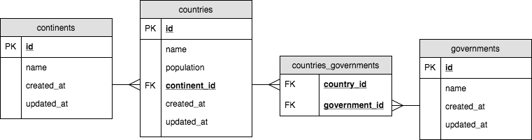

# Knex Migrations Around the World: Creating Migrations

This project will require you to build migrations for the following ERD:

## Instructions

Create migration files that will create four tables: continents, countries, governments, and a join table named countries_governments. Each field should have columns according to the ERD above with the following constraints:

- All ID columns should be auto-incrementing and not nullable
- All fields which would include text should be not nullable and default to an empty string
- All fields which would be integers (excluding primary/foreign keys) should be not nullable and default to 0
- The `created_at` and `updated_at` fields should default to the current time

## Setup

1. Fork & Clone this repository
1. Run `npm install`
1. Create a database called `around_the_world_01_dev`
1. Run `npm test` to run the tests
