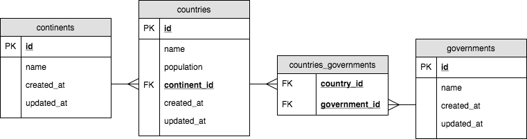

# Knex Seeds Around the World: Seeding Multiple Tables

For this exercise, you will be seeding multiple associated tables. You will need to:

- Drop all data before seeding
- Reset the auto-incrementing ID
- Insert and associate at least one record in all tables

Migrations already appear in this project according to the following ERD:

While you may add to the migrations if you would like to include the option to cascade deletions, you may not remove the foreign key constraint.

While you may simply enter dummy data throughout, if you're interested in building with real data in mind check out [this wikipedia article](https://en.wikipedia.org/wiki/List_of_countries_by_population_(United_Nations)) on countries and their populations.

## Setup

1. Fork & Clone this repository
1. Run `npm install`
1. Run `npm test` to run the tests
1. Un-pend each test by removing the `x` next to the `describe()` function
