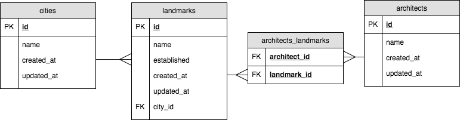

# Cities & Landmarks

To complete this project, you will need to create migrations and seeds according to the following ERD:

You are welcome to insert whatever data you want, however it must be structured in accordance with the above ERD in addition to the following:

- All ID columns should be auto-incrementing and not nullable
- All fields which would include text should be not nullable and default to an empty string
- All fields which would be integers (excluding primary/foreign keys) should be not nullable and default to 0
- The `created_at` and `updated_at` fields should default to the current time

For seeds, you will need to:

- Drop all data before seeding
- Reset the auto-incrementing ID
- Insert and associate at least one record in all tables

## Setup

1. Fork & Clone this repository
1. Run `npm install`
1. Run `npm test` to run the tests
1. Un-pend each test by removing the `x` next to the `describe()` function
